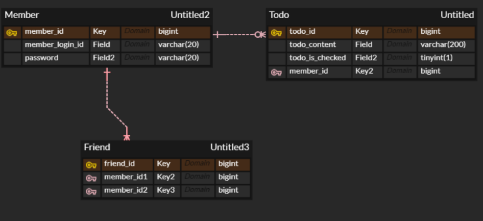
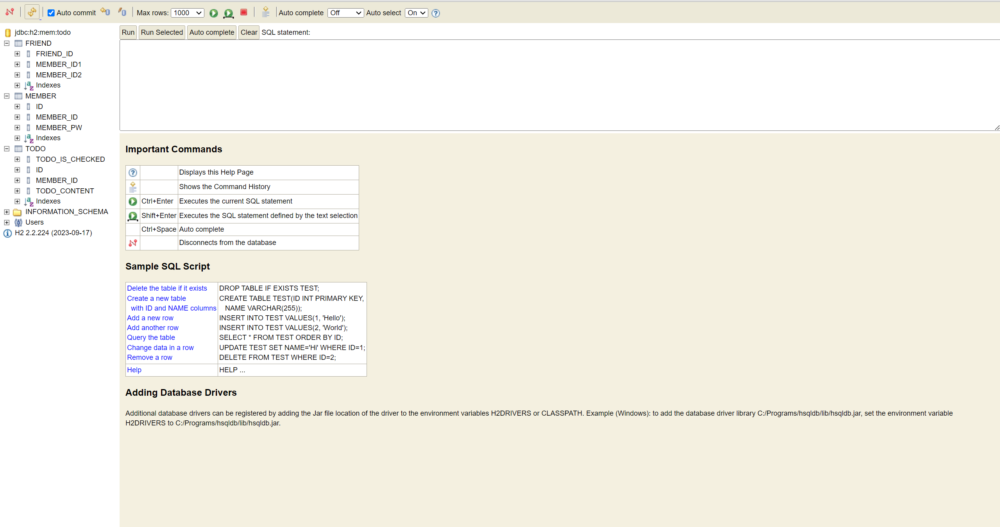

## <초급 백엔드 스터디 4주차 WIL>

### <keyword>
ER model, attribute, pk, entity, JPA

### 배운 내용
-db를 설계할 때는 크게 개체와 관계를 가지고 설계를 한다. 이것을 다이어그램으로 표현하면 ERD라고 한다.
-개체와 관계는 각각 특징을 나타내는 속성을 가진다. 속성 중 개체를 특별히 식별가능하게 하는 속성을 PK라고 한다.
-개체와 개체 사이에는 다대일,일대다,일대일,다대다 관계가 있다.(주로 다대일 관계가 사용된다. @ManyToOne)
-JPA는 자바의 표준 기술로 데이터베이스의 객체를 자바 객체로 바꿔준다(스프링이 아닌 자바의 기술). 이때 단위는 엔티티이다.
-엔티티 클래스를 만들 때는 테이블과 컬럼을 사용해서 만든다.
-@Entity로 이 클래스가 엔티티라는 것을 명시
-@Id로 이 필드가 pk라는 것을 명시
-@JoinColumn으로 외래키 명시( 해당 엔티티 타입의 엔티티 객체를 가지게 함)
-엔티티 객체를 생성할 생성자를 만들어줘야함 (단축키 alt+insert)

